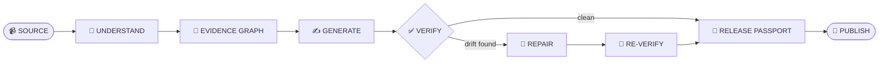
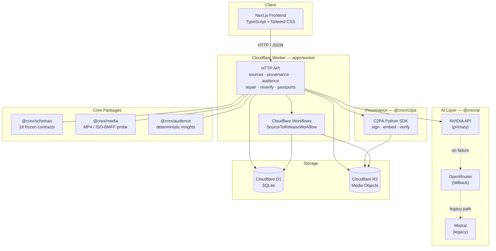

<div align="center">

# 🛡️ Crex
### The Content Integrity Compiler

**Generate creator content. Trace it to evidence. Detect meaning drift. Repair violations. Publish with confidence.**

[]()
[]()
[]()
[](https://crex-worker.loujanb2008.workers.dev)
[]()


[Live Worker](https://crex-worker.loujanb2008.workers.dev) · [Report a Bug](https://github.com/louji2308/Crex/issues) · [Documentation](#-documentation)

</div>

<br/>

<!--
  ADD A HERO SCREENSHOT OR GIF HERE.
  Recommended: 1200×675px (16:9), PNG/WebP or a short screen recording as GIF.
  Save it to docs/images/hero-banner.png in your repo and this will render automatically.
-->
<div align="center">

<br/>
<sub><i>👆 Replace with a screenshot / GIF of Crex in action (e.g. the upload UI or a passport result)</i></sub>
</div>

<br/>

---

## 📋 Table of Contents

- [🎯 What is Crex?](#-what-is-crex)
- [🔄 How It Works](#-how-it-works)
- [🏗️ Architecture](#️-architecture)
- [📸 Screenshots](#-screenshots)
- [🧩 Feature Modules](#-feature-modules)
- [📁 Repository Structure](#-repository-structure)
- [🔒 Frozen Contracts](#-frozen-contracts)
- [🌐 API Reference](#-api-reference)
- [🚀 Getting Started](#-getting-started)
- [🧪 Testing](#-testing)
- [🌍 Live Deployment](#-live-deployment)
- [⚠️ Current Limitations](#️-current-limitations)
- [📚 Documentation](#-documentation)
- [📄 License](#-license)

---

## 🎯 What is Crex?

Crex is an AI content-production system that turns a creator's raw source video into publishable content — social posts, captions, summaries — **without letting the AI drift from what was actually said.**

> **In plain English:** you upload a video. Crex's AI reads it, extracts what was actually claimed, and drafts content based on those claims. Before anything gets published, Crex automatically checks every generated sentence against the original source. If a fact got twisted or a number changed, it repairs the content and checks again. Only content that passes every check gets a **Release Passport** — a signed verdict saying "this is safe to publish."

Three promises drive the design:

| Promise | What It Means |
|---|---|
| 🔗 **Traceable** | Every important claim in the generated output links back to a specific timestamp in the source video. |
| ✅ **Verified** | Nothing publishes without a deterministic verification pass checking for meaning drift, numerical errors, and constraint violations. |
| 🔍 **Honest** | Status is never faked. If provenance is unsigned, the system says `UNSIGNED` — not `VALID`. If AI isn't configured, it returns `503`, not a silent fallback. |

---

## 🔄 How It Works



| Stage | What Happens |
|---|---|
| 📹 **SOURCE** | Creator uploads a raw video. Crex streams it to R2, computes a SHA-256 hash in-flight, and validates the container/codec before accepting it. |
| 🧠 **UNDERSTAND** | AI (NVIDIA primary → OpenRouter fallback) analyzes the source to extract what was actually said. |
| 🔗 **EVIDENCE GRAPH** | Every extracted claim is linked to the exact source segment/timestamp that supports it — the "receipts" behind each fact. |
| ✍️ **GENERATE** | AI drafts publishable content grounded in the evidence graph, respecting creator and sponsor constraints. |
| ✅ **VERIFY** | A verification run checks each generated claim against its evidence and flags meaning drift, numerical errors, or constraint violations. |
| 🔧 **REPAIR** | If VERIFY finds problems, a **deterministic** repair engine (no AI guesswork) proposes concrete fixes. |
| 🔁 **RE-VERIFY** | Repaired content is re-checked against the same evidence to confirm the fix actually worked. |
| 🛂 **RELEASE PASSPORT** | A versioned, frozen-format snapshot compiles the latest verification + provenance state into a `READY` / `DRAFT` / `BLOCKED` verdict with dimension scores. |
| 🚀 **PUBLISH** | Only assets holding a `READY` passport are cleared to go out. |

See [🧩 Feature Modules](#-feature-modules) below for exactly which stages are implemented today and their test status.

---

## 🏗️ Architecture



### Tech Stack

| Layer | Technology |
|---|---|
| Frontend | Next.js + TypeScript + Tailwind CSS |
| Deployment | Cloudflare Pages / Workers |
| Database | Cloudflare D1 (SQLite) |
| Object Storage | Cloudflare R2 |
| Background Processing | Cloudflare Workflows |
| AI (Primary) | NVIDIA (OpenAI-compatible API) |
| AI (Fallback) | OpenRouter (OpenAI-compatible API) |
| AI (Legacy) | Mistral |
| Vector Search | Cloudflare Vectorize + LanceDB (local) |
| Media Processing | In-process MP4/ISO-BMFF probe (`@crex/media`); FFmpeg planned |
| Speech Fallback | WhisperX / faster-whisper |
| Provenance | C2PA Python SDK (`c2pa-python==0.37.10`) |
| Schemas | Zod (TS) + Pydantic (deferred) |
| Testing | Vitest; Playwright + pytest later |
| CI | GitHub Actions |

---

## 📸 Screenshots

<!--
  Drop your screenshots into a `docs/images/` folder at the repo root and
  update the file names below to match. Suggested size: 1200×750px, PNG or WebP.
-->

<table>
<tr>
<td width="50%" valign="top">

**Upload UI** — `GET /sources/ui`
<br/>


</td>
<td width="50%" valign="top">

**Ingestion Status** — `GET /sources/:uploadId`
<br/>


</td>
</tr>
<tr>
<td width="50%" valign="top">

**Provenance Verification** — `GET /provenance/verify`
<br/>


</td>
<td width="50%" valign="top">

**Release Passport** — `POST /passports`
<br/>


</td>
</tr>
<tr>
<td width="50%" valign="top">

**Audience Context** — `GET /audience/context`
<br/>


</td>
<td width="50%" valign="top">

**Live Worker Health** — `GET /health`
<br/>


</td>
</tr>
</table>

---

## 🧩 Feature Modules

<table>
<tr><td width="70">🎬</td><td>

**Source Ingestion — Wave 3**
`COMPLETE + VERIFIED LIVE`

Upload → R2 → D1 → media validation → `SourceAsset` → workflow ingestion → `READY`. Includes a hard size cap, in-flight SHA-256 hashing, MP4/ISO-BMFF probing without FFmpeg, and a minimal upload UI.

</td></tr>
<tr><td>🔏</td><td>

**Provenance Foundation — Wave 13**
`COMPLETE + TESTED`

A frozen `ProvenanceRecord` contract, real signed C2PA embedding/verification via the official Python SDK, and an **honest trust model** — an unanchored signature is reported `Valid` but `signature_trusted=false`, never faked as trusted.

</td></tr>
<tr><td>👥</td><td>

**Audience Context + Learning — Wave 14**
`IMPLEMENTED + TESTED`

Deterministic (no-AI) aggregation of audience facts into profiles, insights (`DIVERGENCE`, `GAP`, `DATA_INSUFFICIENT`), and recommendations (`ACKNOWLEDGE_LIMITS`, `SPLIT`, `EXPAND`).

</td></tr>
<tr><td>🔧</td><td>

**Repair Engine + Re-verification — Wave 10/11**
`IMPLEMENTED`

Deterministic `PROPOSED` repair actions for verification failures, with a `/reverify` path that applies fixes and re-runs the verifier for real.

</td></tr>
<tr><td>🛂</td><td>

**Release Passport — Wave 12**
`IMPLEMENTED + TESTED`

Compiles the latest verification + provenance state into a versioned snapshot: `release_status` (`DRAFT`/`BLOCKED`/`READY`), `watch_status`, an `overall_score`, and four dimension scores. **No `READY` while provenance isn't `VALID`.**

</td></tr>
<tr><td>🛡️</td><td>

**Hardening — Waves 17–19**
`COMPLETE + INTEGRATED`

Threat model, verification scoping, a 33/33 adversarial benchmark suite, the deterministic real-signed C2PA path, a deploy runbook, a CORS layer, and CI — all wired in, not bolted on.

</td></tr>
</table>

---

## 📁 Repository Structure

```text
Crex/
├── apps/
│   └── worker/               # Cloudflare Worker: Workflows + D1 + R2 + HTTP API
├── packages/
│   ├── schemas/               # Frozen contract schemas (18), types, registry
│   ├── db/                    # D1-compatible SQLite: migrations + data-access
│   ├── core/                  # Config/env loader, ApiError, logger, workflow state
│   ├── ai/                    # NVIDIA (primary) + OpenRouter (fallback); Mistral legacy
│   ├── infra/                 # D1/R2 adapters over the @crex/db seam
│   ├── media/                 # MP4 probe, media validation, incremental SHA-256, fixtures
│   ├── c2pa/                  # C2PA provenance: manifest build/verify + Python CLI gateway
│   ├── audience/               # Deterministic audience aggregation/insights/recommendations
│   └── tests/                  # Fixtures, contract conformance, db integration
├── docs/
│   ├── engineering-baseline.md
│   └── implementation/        # Wave 0 audits + decision records
├── Project Spec/               # Authoritative specifications
├── AGENTS.md                   # Engineering operating system
└── progress.md                 # Operational progress record
```

---

## 🔒 Frozen Contracts

All API and database shapes are locked behind Zod contracts in `@crex/schemas` — nothing crosses a package boundary without validation.

| Category | Contracts |
|---|---|
| Project & Source | `Project`, `SourceAsset`, `TranscriptSegment` |
| Evidence & Claims | `Claim`, `Evidence` |
| Generated Content | `GeneratedAsset`, `GeneratedComponent` |
| Verification | `VerificationRun`, `VerificationFinding` |
| Constraints | `Constraint`, `SponsorRequirement` |
| Repair & Release | `RepairAction`, `ReleasePassport` |
| Provenance | `ProvenanceRecord` |
| System / API | `WorkflowState`, `ApiResponse`, `AiOutput`, `ApiError` |

**Wave 14 audience contracts** (deep imports in `packages/schemas/src/audience.ts`): `AudienceProfile`, `AudienceObservation`, `AudienceInsight`, `AudienceRecommendation`, `AudienceContext`.

**Deferred** (registry-documented, no code yet): `PerformanceObservation`, `LearningRecord`.

---

## 🌐 API Reference

### Core

| Method | Path | Behavior |
|---|---|---|
| `GET` | `/health` | Bindings + config status |
| `POST` | `/ai/analyze` | Generate → validate → persist an `AiOutput` (`SEMANTIC_UNDERSTANDING` only; `503` without an API key) |
| `POST` | `/workflows/source-to-release` | Create + run a workflow instance (`{projectId, id?, sourceId?}`) |
| `GET` | `/workflows/source-to-release/:id` | Instance status/phase |

### Source Ingestion

| Method | Path | Behavior |
|---|---|---|
| `POST` | `/sources` | Create an upload session (`201`) |
| `PUT` | `/sources/:uploadId/blob` | Stream blob to R2 (size-capped, media-validated; `200` `VALID`/`INVALID`) |
| `GET` | `/sources/:uploadId` | Poll upload/source status |
| `GET` | `/sources?projectId=` | List sources for a project |
| `GET` | `/sources/ui` | Minimal upload UI (XHR progress + 800ms polling) |

### Provenance

| Method | Path | Behavior |
|---|---|---|
| `POST` | `/provenance/records` | Provision a record from real R2 bytes (SHA-256, `UNSIGNED`) |
| `GET` | `/provenance/records/:id` | Fetch a provenance record |
| `GET` | `/provenance/verify` | Re-hash R2 bytes + C2PA verify → `VALID`/`INVALID`/`UNSIGNED`/`UNTRUSTED`/`MISSING` |

### Audience Context

| Method | Path | Behavior |
|---|---|---|
| `POST` | `/audience/profiles` | Create a named audience profile |
| `GET` | `/audience/profiles?projectId=` | List profiles |
| `POST` | `/audience/observations` | Record an observation (idempotent) |
| `GET` | `/audience/observations?projectId=` | List observations |
| `POST` | `/audience/compute` | Deterministic aggregate → insights → recommendations |
| `GET` | `/audience/context?projectId=` | Assembled audience context |

### Repair, Re-verification & Release Passport

| Method | Path | Behavior |
|---|---|---|
| `POST` | `/repair` | Create `PROPOSED` repair actions for a verified asset |
| `POST` | `/repair/:actionId/apply` | Apply a proposed repair action |
| `POST` | `/reverify` | Apply all proposed repairs, then re-run the verifier |
| `GET` | `/repair/actions?assetId=` | List repair actions for an asset |
| `GET` | `/repair/actions?runId=` | List repair actions tied to a verification run |
| `POST` | `/passports` | Create a Release Passport snapshot (`{projectId, assetId}`) |
| `GET` | `/passports?projectId=` | List a project's passports |
| `GET` | `/passports/:id` | Fetch a passport by id |
| `GET` | `/passports/:assetId/latest` | Fetch the latest passport for an asset |

---

## 🚀 Getting Started

**Requires:** Node ≥ 24, pnpm ≥ 11

```bash
# 1. Install dependencies
pnpm install

# 2. Configure at least one AI provider key
cp apps/worker/.dev.vars.example apps/worker/.dev.vars
# fill in NVIDIA_API_KEY, OPENROUTER_API_KEY, and/or MISTRAL_API_KEY

# 3. Apply migrations to local D1
cd apps/worker
npx wrangler d1 migrations apply crex --local

# 4. Run the worker locally
pnpm --filter @crex/worker dev
```

### Deploying to production

```bash
cd apps/worker
npx wrangler d1 migrations apply crex --remote
npx wrangler deploy
```

> ⚠️ `pnpm --filter @crex/worker deploy` won't work — pnpm reserves `deploy` as a subcommand. Use `npx wrangler deploy` from `apps/worker` instead.

Migrations live in `packages/db/migrations` and run **wrangler-side** (not inside the worker — `node:fs` is unavailable in `workerd`). See `docs/implementation/decision-workflow-migrations.md`.

---

## 🧪 Testing

```bash
pnpm -r typecheck   # strict TS across all packages — 11/11 green
pnpm -r test        # Vitest across all workspaces — 717 tests incl. 33 adversarial benchmarks
```

| Workspace | Tests |
|---|---:|
| `@crex/schemas` | 154 |
| `@crex/tests` | 106 |
| `@crex/db` | 67 |
| `@crex/infra` | 37 |
| `@crex/ai` | 36 |
| `@crex/media` | 29 |
| `@crex/c2pa` | 21 |
| `@crex/core` | 20 |
| `@crex/audience` | 12 |
| `apps/worker` | 202 |
| `benchmarks` (adversarial) | 33 |
| **Total** | **717** |

---

## 🌍 Live Deployment

| Resource | Detail |
|---|---|
| **Worker** | [`crex-worker.loujanb2008.workers.dev`](https://crex-worker.loujanb2008.workers.dev) |
| **D1 Database** | `crex` — migrations `0001`–`0011` applied remotely, no pending migrations |
| **R2 Bucket** | `crex-media`, bound as `MEDIA` |
| **Bindings** | `DB`, `MEDIA`, `SOURCE_TO_RELEASE` |

Verified end-to-end live: upload → `POST /sources` (`201`) → `PUT /sources/:id/blob` (`200 VALID`, real R2 write + D1 insert) → `POST /workflows/source-to-release` → source reaches `READY`, confirmed by reading the row back from remote D1.

See `docs/implementation/deploy-runbook.md` for the full deploy/migration/rollback runbook and CORS/Pages guidance.

---

## ⚠️ Current Limitations

- The `INVALID` validation reason is returned in the API/UI but not yet persisted on the source row.
- Worker routes have no auth or rate limiting yet (prototype scope).
- Media validation is MP4/ISO-BMFF-focused; other containers are rejected as unsupported.
- The configured NVIDIA model (`meta/llama-3.3-70b-instruct`) is end-of-life, so live AI calls currently fall back to OpenRouter. Without any provider key, `/ai/analyze` returns `503 AI_NOT_CONFIGURED` (honest gating, not a silent failure).

---

## 📚 Documentation

| Document | Location |
|---|---|
| Engineering Operating System | `AGENTS.md` |
| Hackathon Requirements | `Project Spec/Hackathon details & requirements.md` |
| Product Specification | `Project Spec/Idea.md` |
| Implementation Plan | `Project Spec/Implementation.md` |
| Architecture & Tech Stack | `Project Spec/Architecture & Techstack.md` |
| Engineering Progress | `progress.md` |
| Engineering Baseline | `docs/engineering-baseline.md` |

---

## 📄 License

Not yet determined.

## 🙏 Acknowledgments

Built for the **AI Content Engine Hackathon** (September 2026).

<div align="center">
<sub>Made with 🛡️ by the Crex team</sub>
</div>